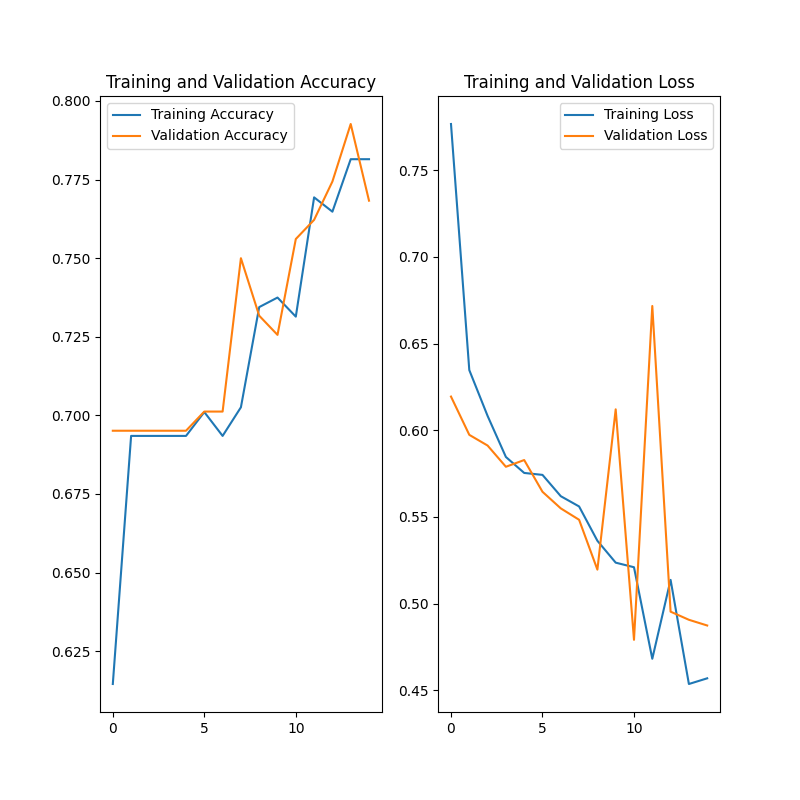

# Hot-Dog-or-Pizza
A convolutional neural network implemented in Tensorflow to identify an image as either a hot dog or a pizza. The idea was inspired from Jian Yang's See Food app in the HBO television series **Silicon Valley**.  The dataset used to train the model was created by using the [Google Images Download](https://github.com/hardikvasa/google-images-download) library to scrape images from Google Images.

## Usage
Download the files and run it on a machine with at least Python 3.7 or higher. 

Due to copyright reasons, the image datasets used for training are not included. 

### Training
The time for training the model will vary depending on the machine. For faster training times, you can enable GPU support which requires installing the drivers and libraries.

An alternative is to reduce the number of epochs (currently set at 15). Note that this comes at a cost. Too few epochs will mean that the model won't be as accurate.  

## Evaluation
The model was able to predict the image as one of either categories (i.e hot dog or pizza) with a confidence level from 50-70 percent. The confidence level is certainly not good but it does serve as the basis of a convolutional neural network for image classification. There is certainly a lot of room for improvement to enhance its prediction accuracy one of which would be tuning the hyperparameters.

## License
The software is under the MIT license.
