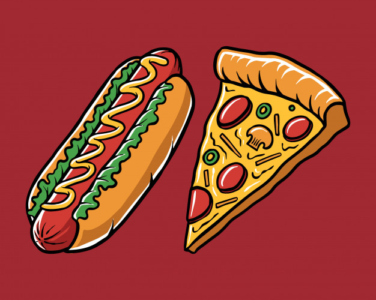

# Hot-Dog-or-Pizza

# Background
A convolutional neural network implemented in Tensorflow to identify an image as either a hot dog or a pizza. The idea was inspired from Jian Yang's See Food app in the HBO television series **Silicon Valley**.  The dataset used to train the model was created by using the [Google Images Download](https://github.com/hardikvasa/google-images-download) library to scrape images from Google Images.

# Evaluation
The model was able to predict the image as one of either categories (i.e hot dog or pizza) with a confidence level from 50-70 percent. The confidence level is certainly not good but it does serve as the basis of a convolutional neural network for image classification. There is certainly a lot of room for improvement to enhance its prediction accuracy one of which would be tuning the hyperparameters.

